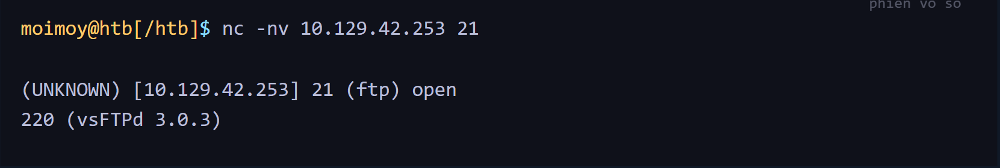
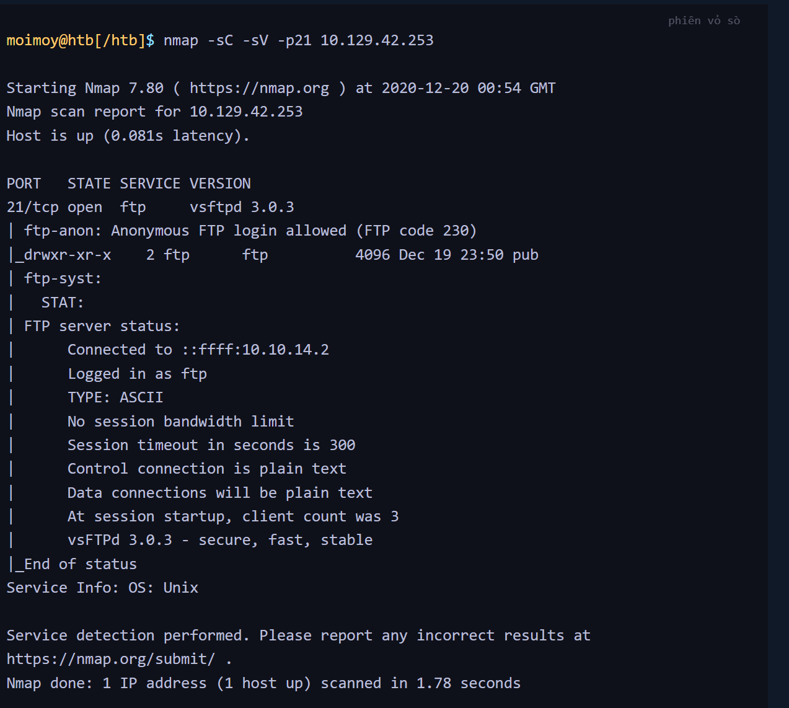
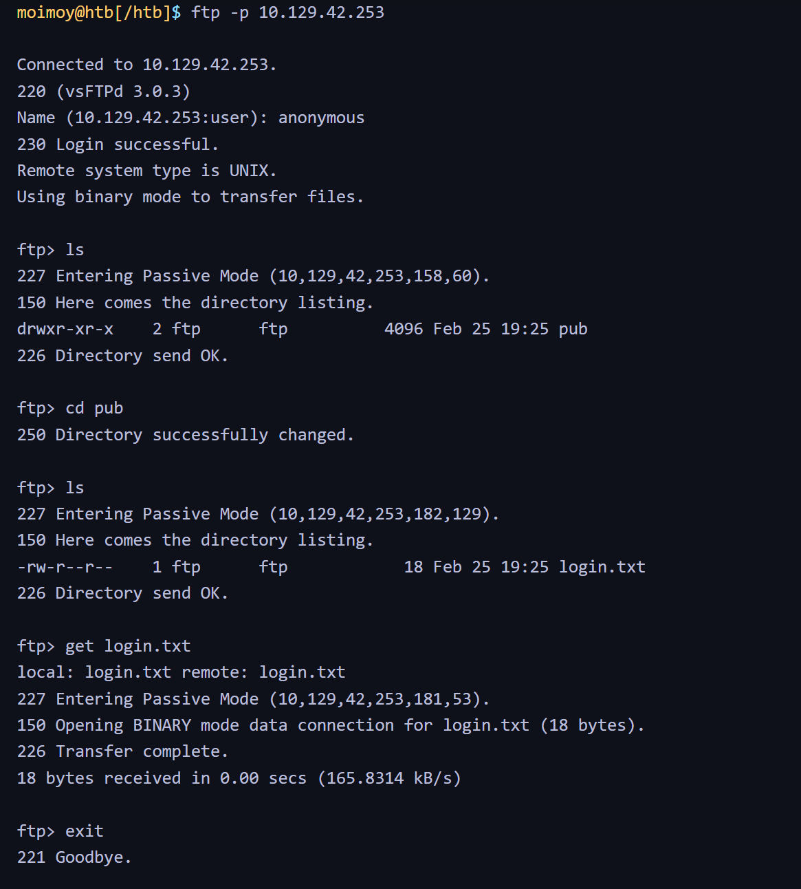
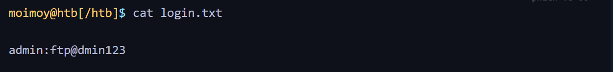
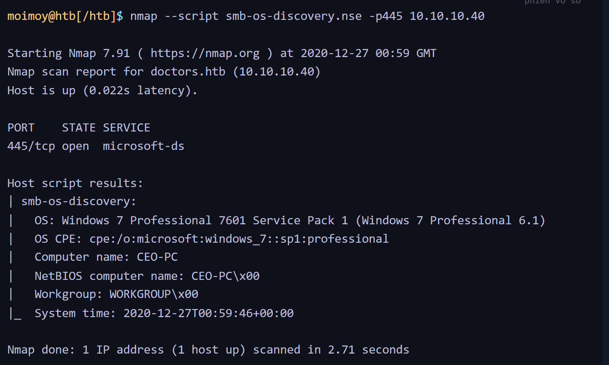
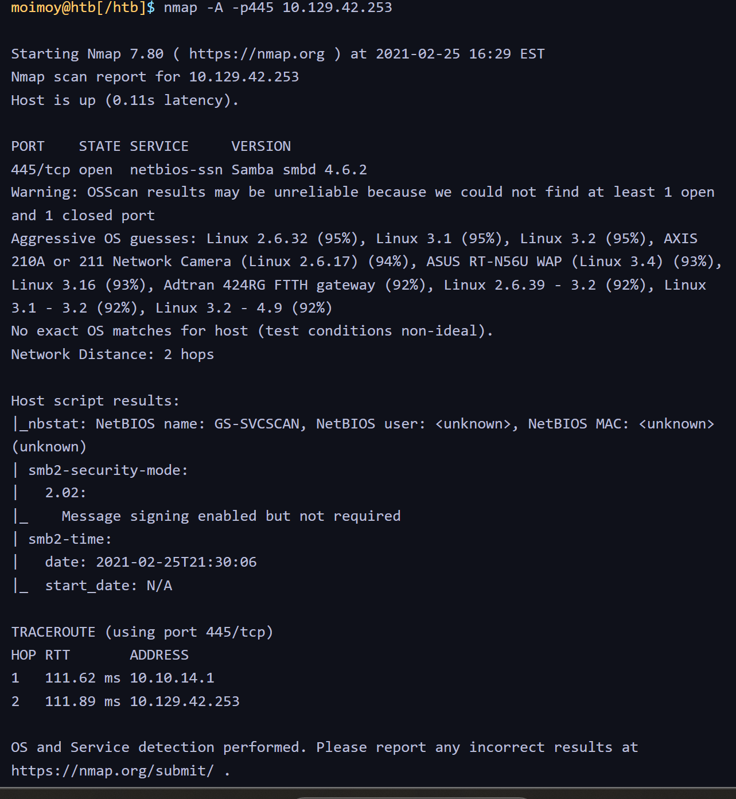
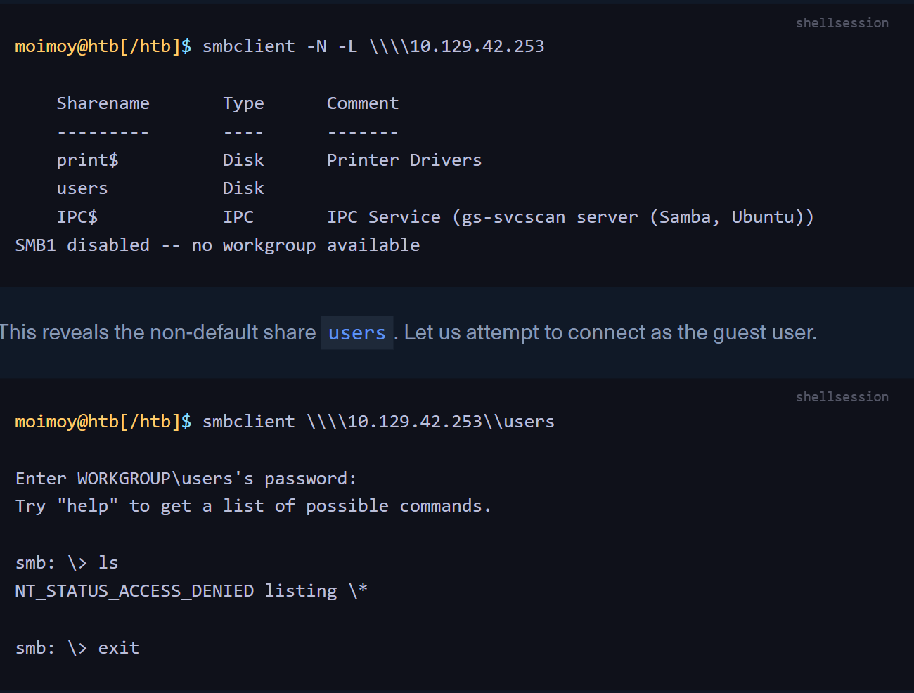
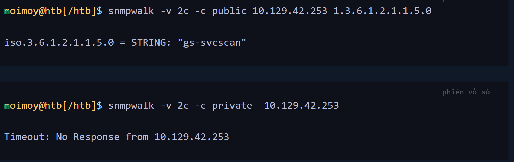
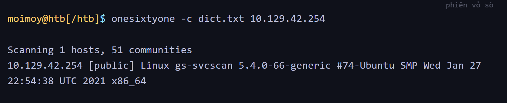

#  SERVICE SCANNING
- Đầu tiên cần làm: Xđịnh hệ điều hành và bất kì dịch vụ nào đang chạy -> các máy lưu trữ dịch vụ là máy chủ 
- MÁy tính đc gán 1 địa chỉ IP, các dịch vụ chạy trên máy tính thì đc gán port để có thể chạy đc
- Để truy cập từ xa thì cần kết nối địa chỉ IP và số cổng chính xác
- Việc ktra toàn bộ cổng -> tốn tgian và công sức -> Công cụ Nmap 
# NMAP
- Câu lệnh kết nối 

- Chương trình sẽ quét TCP mặc định trừ khi đc yêu cầu quét UDP 
- Tiêu đề STATE để xác nhận rằng các cổng đang mở, đôi khi sẽ có trạng thái khác, filtered -> Xảy ra nếu tường lửa chỉ cho phép truy cập vào các cổng từ các địa chỉ cụ thể
- Có thể sử dụng -sC -> thông tin chi tiết hơn; -sV -> thực hiện quét phiên bản ; -p- muốn quét tca các cổng 
# TẤN CÔNG DỊCH VỤ MẠNG 
# Giật Banner 
- Nmap sẽ cố gắng lấy các banner nếu cú ​​pháp nmap -sV --script=banner <target>
- Có thể làm thủ công bằng ncat 

# FTP 
- Giao thức tiêu chuẩn 
- Quét cổng mặc định cho FTP (21) cho thấy cài đặt vsftpd 3.0.3 mà chúng ta đã xác định trước đó. Hơn nữa, nó cũng báo cáo rằng xác thực ẩn danh đã được bật và một pub thư mục có sẵn.

- Kết nối ftp bằng dòng lệnh
 
 - FTP hỗ trợ các lệnh thông dụng và cho phép tải xuống tệp tin bằng lệnh get -> Ktra các tập tin login.txt Cho thất ttin đăng nhập 
 
# SMB 
- SMB (Server Message Block ) là 1 giao thức phổ biến trên các máy tính WINDOWS, cung cấp nhiều lỗ hổng cho việc xâm nhập theo chiều rộng hoặc chiều ngang
- Nmap có nhiều tập leejng để liệt kê SMB cụ thể như: smb-os-discovery.nse 

- Quét mục tiêu trong phần module này để thu tập ttin 

# SHARES
- Giao thức SMB cho phép người dùng và quản trị viên chia sẻ thư mục và cho người khác truy cập từ xa 
- The -L flag specifies that we want to retrieve a list of available shares on the remote host, while -N suppresses the password prompt.

# SNMP 
- Chuỗi SNMP cung cấp thông tin và số liệu thống kê về bộ định tuyến hoặc thiết bị, giúp chúng ta truy cập vào chúng.
- Trong các phiên bản SNMP 1 publicvà private2c, quyền truy cập được kiểm soát bằng cách sử dụng chuỗi cộng đồng dạng văn bản thuần, và nếu chúng ta biết tên, chúng ta có thể truy cập vào nó. 

- Một công cụ như onesixtyone có thể được sử dụng để tấn công vét cạn tên chuỗi cộng đồng bằng cách sử dụng tệp từ điển chứa các chuỗi cộng đồng phổ biến, chẳng hạn như dict.txttệp được bao gồm trong kho lưu trữ GitHub của công cụ này. 

