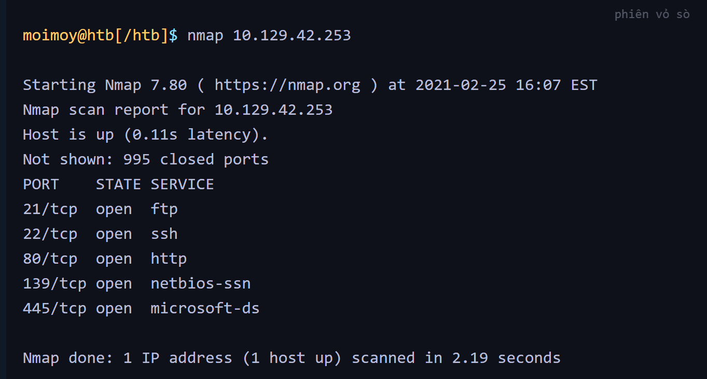

#  SERVICE SCANNING
- Đầu tiên cần làm: Xđịnh hệ điều hành và bất kì dịch vụ nào đang chạy -> các máy lưu trữ dịch vụ là máy chủ 
- MÁy tính đc gán 1 địa chỉ IP, các dịch vụ chạy trên máy tính thì đc gán port để có thể chạy đc
- Để truy cập từ xa thì cần kết nối địa chỉ IP và số cổng chính xác
- Việc ktra toàn bộ cổng -> tốn tgian và công sức -> Công cụ Nmap 
# NMAP
- Câu lệnh kết nối 

